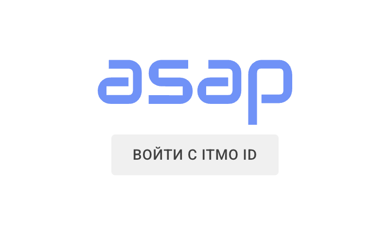
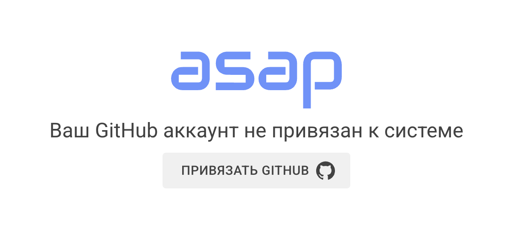

# ASAP – инструкция для начала работы с системой

ASAP – система, позволяющая автоматизировать отслеживание отправленных студентами работ, формирование очередей сдачи,
отслеживание событий сдачи работ и расчёт баллов студентов.

Для использования системы вам необходимо будет пройти регистрацию в ней. Для этого необходимо авторизоваться,
используя ITMO ID.

   

Далее необходимо привязать свой github, используя который, в будущем Вы будете отправлять/проверять лабораторные работы.

   

