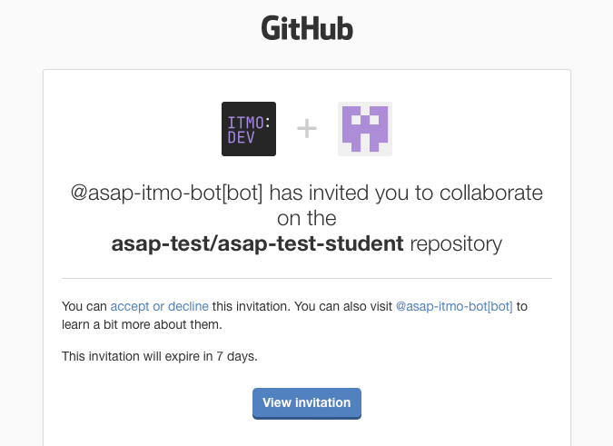
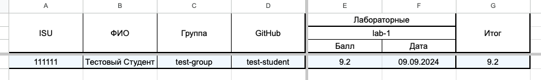
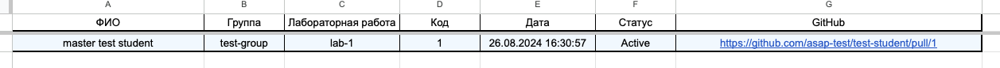
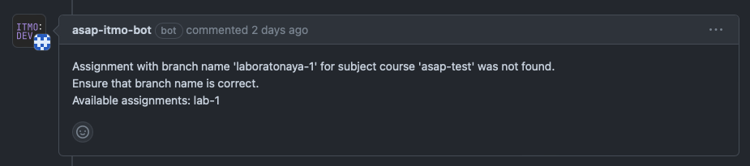
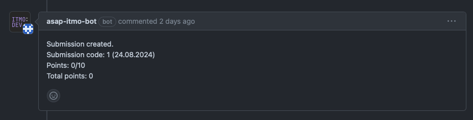

# ASAP – инструкция для студентов

После авторизации на сайте Вы должны будете ожидать приглашения в репозиторий организации GitHub Вашего курса,
который будет иметь название, соответствующее Вашему нику на GitHub. В этот репозиторий Вы должны будете
загружать Ваши лабораторные работы на протяжении прохождения всего курса. Приглашение в данный репозиторий придёт Вам на
почту, к которой привязан Ваш GitHub аккаунт.

   

Также, система предоставляет возможность просмотра баллов и очередей на сдачу через Google таблицы, ссылку на таблицу
Вашей дисциплины предоставят преподаватели.

   

   

# Основной workflow студента

## Загрузка работы

С точки зрения студента, работа с системой ASAP подразумевает простое взаимодействие с GitHub. Давайте рассмотрим какие
шаги необходимо сделать для того чтобы система увидела и начала отслеживать Вашу работу.

1. Перед началом выполнения лабораторной работы – создайте ветку с названием соответствующим данной лабораторной работе
   Эти наименования настраиваются преподавателями, и они предоставят Вам информацию о корректном нейминге.
2. Далее, после выполнения работы, запуште её на GitHub и создайте pull request из созданной Вами ветки в
   ветку `master`/
   `main`.
    1. Если Вы изначально выбрали некорректное название ветки, не соответствующее какой-либо лабораторной, Вы получите
       комментарий-предупреждение от нашего бота.

       

    2. Если загрузка работы прошла успешно, бот так же оповестит Вас об этом.

       

В терминах системы, работа, которую Вы загружаете – называется сабмишен. И на одну лабораторную работу студент может
иметь
несколько таких сабмишенов.

После успешной загрузки работы, Ваш сабмишен должен появиться в соответсвующей очереди.

## Сдача работ

Как только сабмишен попадает в очередь, преподаватель может его проверить. У проверки может быть 3 результата:

1. Преподаватель не удовлетворён Вашей работой.
   Такой результат происходит, когда преподаватель оставляет change request в вашем pull request и Ваш сабмишен пропадёт
   из очереди. Вы должны будете исправить замечания и загрузить исправления в ту же ветку, в тот же pull request. После
   загрузки исправлений, система создаст новый сабмишен и Вы снова появитесь в очереди.
2. Преподаватель предварительно одобрил Вашу работу.
   Такой результат происходит, когда преподаватель ставит approve Вашему pull request. Это значит что преподаватель
   удовлетворён Вашей работой, но ожидает защиты. В таком случае Ваш сабмишен будет помечен зелёным цветом в
   очереди.
3. Преподаватель удовлетворён Вашей работой.
   Такой результат происходит, когда преподаватель выполняет merge на Вашем pull request или использует специальные
   команды для оценки.
   После того как Ваш pull request будет смержен, Ваш сабмишен пропадёт из очереди, а в общей таблице появятся Ваши
   баллы за сданную работу.

**Важно! Сабмишен оценивается только преподавателям, если Вы смержите pull request самостоятельно до того как он будет
оценён преподавателем, то он будет деактивирован и пропадёт из очереди.**

# Дедлайны и штрафы

Система предоставляет возможность преподавателям настраивать дедлайны по выполнению лабораторных работ. Система также
автоматически рассчитывает штрафы за просрочку дедлайнов. Баллы, находящиеся в общей таблице пишутся с их учётом.

За каждую неделю просрочки дедлайнов, ваши максимальные баллы за лабораторную работу сокращаются на 20%.