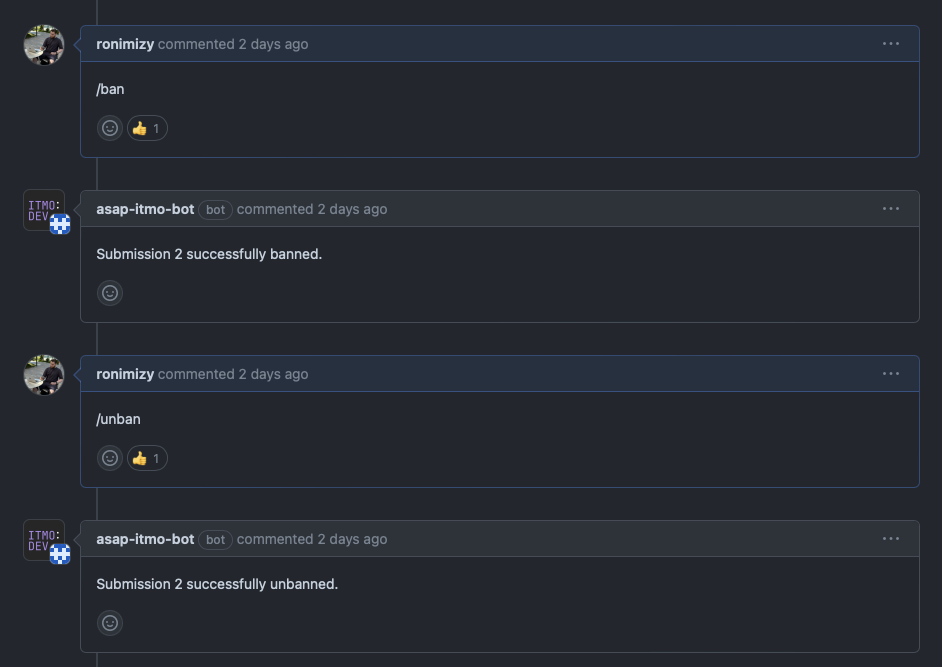

# Инструкция для преподавателей

ASAP – система, позволяющая автоматизировать отслеживание отправленных студентами работ, формирование очередей сдачи,
отслеживание событий сдачи работ и расчёт баллов студентов.

После настройки системы для Вашей дисциплины, для Вас будут доступны несколько ресурсов.

1. Организация на GitHub в которую студенты будут загружать свои лабораторные работы.
2. Таблица в Google Sheets, где находятся таблицы с очередями (на каждую группу) и общая таблица с баллами студентов.

# Основной workflow преподавателя

Основной точкой входа для Вас будет являться Google таблица, а именно – страница с очередью группы, пару которой Вы
ведёте (она имеет то же название, что и название группы). В данной таблице находятся загруженные работы (сабмишены), в
привязке к конкретной лабораторной работе. В этой очереди указаны имена студентов, а также ссылки на их pull requestы
на GitHub.

После того, как Вы проверили работу студента, Вы должны оценить её каким-либо образом. У проверки работ может быть
несколько результатов:

1. Работа не удовлетворяет преподавателя.
   В таком случае Вы должны просто отправить “Request changes” в pull request на GitHub. В таком случае система
   определит, что данный сабмишен не устраивает преподавателя (и бот напишет в pull request комментарий об этом) и
   автоматически уберёт студента из очереди, обозначая необходимость доработок. Закрывать pull request в таком случае не
   нужно.
   После выполнения правок студент должен загрузить их в ту же ветку, в тот же pull request. После этого будет создан
   новый сабмишен с увеличенным кодом (поле Код означает номер попытки сдачи лабораторной)

   

2. Работа удовлетворяет преподавателя
   В таком случае, Вы можете просто смержить pull request с сабмишеном, система автоматически воспримет это действие как
   выставление студенту 100% баллов за этот сабмишен. Система также рассчитает штраф за просрочку дедлайна для этого
   сабмишена и итоговые баллы, эта информация будет обновлена в общей таблице и выведена ботом в качестве комментария к
   pull request.
   Если работа студента вас удовлетворила, но не на 100%, вы также можете использовать команды бота, в комментарии в
   мержу сабмишена, например, для оценки работы студента в 50% используйте команду `/rate 50` в комментарии к мержу.

   

<aside>
❗ Преподаватель оценивает работы студентов в процентах (условных единицах), такой подход позволяет не думать о количестве баллов во время оценки работ и сосредоточиться на их содержании.

</aside>

Обратите внимание, что после оценки сабмишена, нельзя использовать на нём команду `/rate`. См. следующий раздел для того
чтобы узнать как изменять оценку сабмишена.

# Дополнительные баллы и редактирование сабмишена

Преподаватель имеет возможность изменять данные сабмишена. Для этого используется команда бота `/update` и её флаги для
обновления даты (`-d`), оценки (`-r`), дополнительных баллов (`-e`).

Изменение даты доступно всегда, такой функционал может понадобиться, если Вы хотите смягчить штраф за просрочку
студентом
дедлайна.

Изменение баллов и доп баллов доступно только после того как сабмишен будет оценён в первый раз.

<aside>
❗ Для более подробной документации по командам бота, вы можете отправить в pull request комментарий с командой `/help`.

</aside>

# Предварительное одобрение работ

Зачастую преподаватели проверяют работы студентов и во внеучебное время. В таком случае преподаватель
может оценить код студента, и предварительно его одобрить. Предварительно одобренную работу можно в последствие принять
во время пары просто выслушав теоретическую защиту студента.

Для того чтобы предварительно одобрить работу, преподавателю необходимо всего лишь поставить Approve на pull request
студента. После этого, система автоматически выделит студента в очереди зелёным цветом и переместит его в конец очереди,
давая визуальное разделение сабмишенов имеющих предварительное одобрение и нет.

# Очереди

Очереди генерируются системой автоматически в рамках одной группы. Система рассчитывает приоритет сабмишена в очереди по
следующим правилам

1. Сабмишен с текущей лабораторной (наиболее близкий дедлайн, который ещё не наступил)
2. Сабмишен не текущей лабораторной, но загруженный в срок
3. Сабмишен, загруженный раньше всех из загруженных не в срок

Очереди обновляются автоматически, реагируя на события проверок и загрузок работ студентами.

# Баны

Система также поддерживает функционал банов, используемых в случае, если Вы обнаружили плагиат. Бан сабмишена приводит к
тому, что студент получает 0 баллов за лабораторную вне зависимости от того, как оценены его сабмишены. Бан также
обозначается красным цветом ячейки в общей таблице.

Для того чтобы забанить сабмишен, используйте команду бота `/ban`, для случаев когда работу необходимо разбанить,
существует команда `/unban`.

# Рассчёт баллов

Студент может иметь несколько сабмишенов, они могут быть как оценёнными, так и нет. Каждый сабмишен имеет рейтинг –
процентное значение оценки работы преподавателем. Также сабмишен имеет дополнительные баллы и может иметь штраф за
дедлайн. На основе всех этих факторов вычисляются итоговые баллы сабмишена. Итоговыми баллами студента за лабораторную
работу является максимальное значение итоговых баллов сабмишена по этой лабораторной работе.