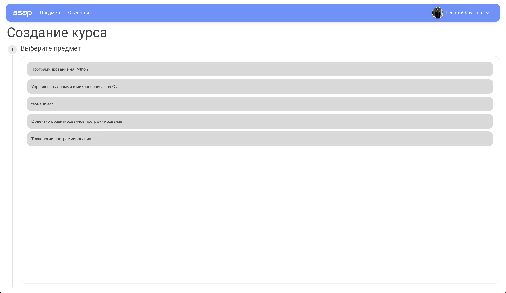
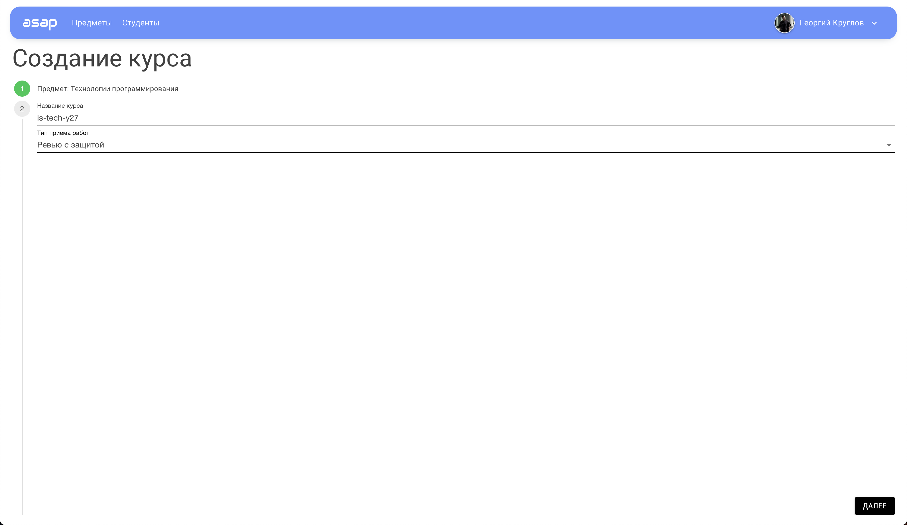
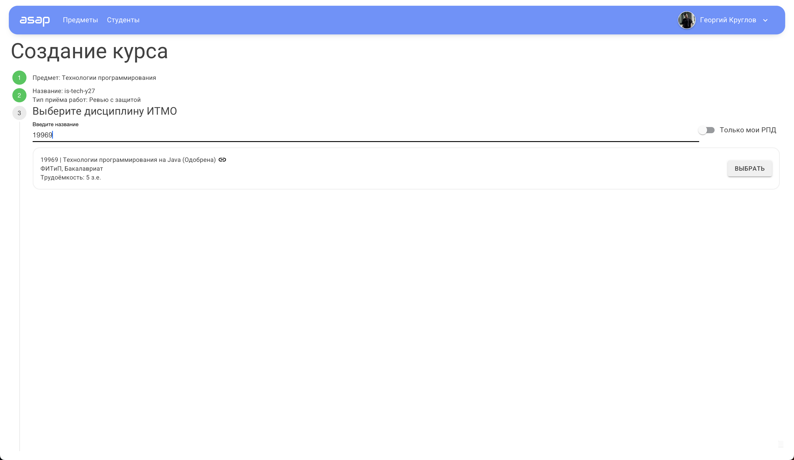
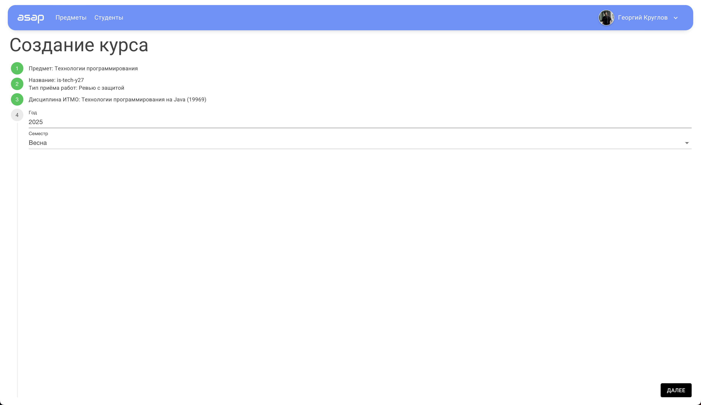
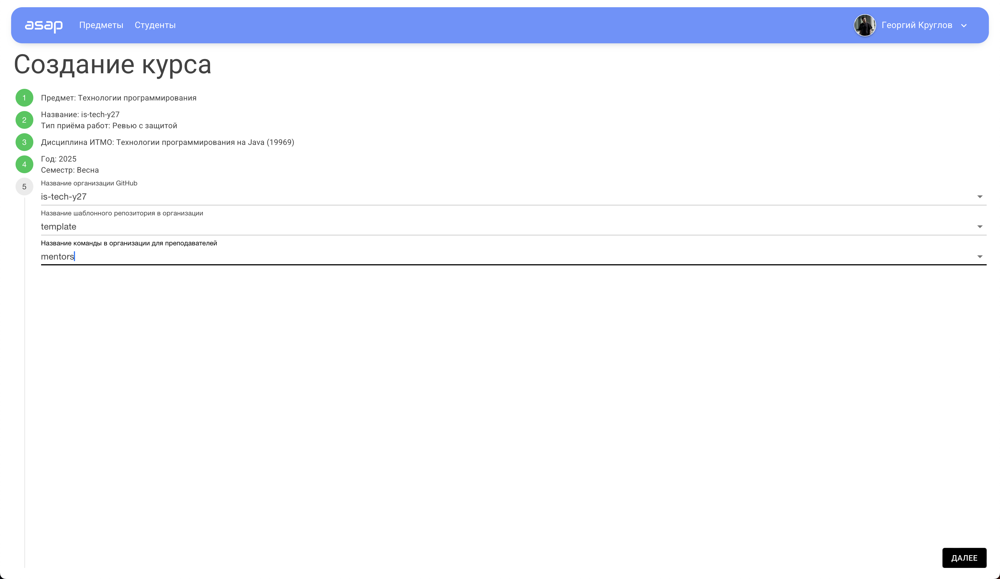

# Создание курса

## Предварительные действия

1. Создайте организацию для курса на GitHub (для каждого курса необходимо заводить отдельные организации)
2. В организации создайте шаблонный репозиторий на основе которого будут создаваться репозитории ваших студентов
3. В организации создайте команду для преподавателей, ей будет выдаваться доступ в репозитории студентов, а также в неё
   автоматически будут добавляться преподаватели.
4. Установите в организацию GitHub бота
   ASAP – https://github.com/apps/asap-itmo-bot (https://docs.github.com/en/apps/using-github-apps/installing-a-github-app-from-a-third-party).
   ВАЖНО! Устанавливая приложение, выбирайте все репозитории.
5. Найдите РПД вашей дисциплины (https://my.itmo.ru/programs?type=1) далее на её основе вы будете заводить курс. ВАЖНО!
   Необходимо выбрать РПД на основе которой ваш предмет заведён в расписании ИТМО, иначе, ни преподаватели, ни студенты
   не будут добавлены на курс.

## Создание курса в ASAP

1. Перейдите на страницу создания курса – https://asap.itmo.space/courses/create
2. Выберите нужный предмет 
3. Заполните информацию об организации 
4. Выберите РПД ИТМО 
5. Выберите период проведения дисциплины 
6. Выберите организацию на GitHub, шаблонный репозиторий и команду
   преподавателей 
7. Нажмите кнопку создать!

---